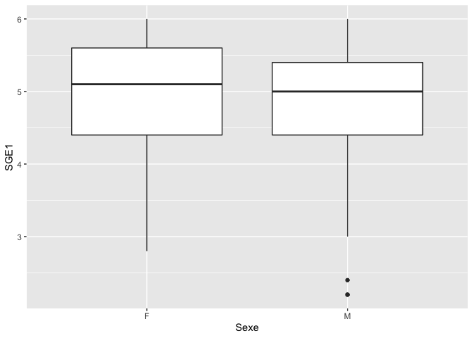

jour2
================
JM GALHARRET
12/16/2019

# Graphiques (suite)

``` r
BD2 <- read.csv("~/Nextcloud/Formation doctorale/BD2.csv")
library(ggplot2)
```

## Histogramme + densité

?geom\_histogram

``` r
ggplot(BD2, aes(x=SGE1)) + 
 geom_histogram(aes(y=..density..), colour="black", fill="white",breaks=2:6)+
 geom_density(alpha=.2, fill="#FF6666") 
```

    ## Warning: Removed 20 rows containing non-finite values (stat_bin).

    ## Warning: Removed 20 rows containing non-finite values (stat_density).

<!-- -->

``` r
ggplot(BD2, aes(x=SGE1,color=Sexe,fill=Sexe)) + 
 geom_histogram(aes(y=..density..),position="identity" ,breaks=seq(2,6,by=.5),alpha=.5)+
 geom_density(alpha=.2) +facet_grid(Sexe ~ .)
```

    ## Warning: Removed 20 rows containing non-finite values (stat_bin).

    ## Warning: Removed 20 rows containing non-finite values (stat_density).

<!-- -->

## Graphiques de corrélations

``` r
library(GGally)
```

    ## Registered S3 method overwritten by 'GGally':
    ##   method from   
    ##   +.gg   ggplot2

``` r
ggpairs(subset(BD2,select=SGE1:SGE3))
```

    ## Warning: Removed 20 rows containing non-finite values (stat_density).

    ## Warning in (function (data, mapping, alignPercent = 0.6, method =
    ## "pearson", : Removed 20 rows containing missing values

    ## Warning in (function (data, mapping, alignPercent = 0.6, method =
    ## "pearson", : Removed 20 rows containing missing values

    ## Warning: Removed 20 rows containing missing values (geom_point).
    
    ## Warning: Removed 20 rows containing missing values (geom_point).

<!-- -->

``` r
ggpairs(subset(BD2,select=c(Sexe,SGE1:SGE3)),
        mapping=ggplot2::aes(colour=Sexe))
```

    ## Warning: Removed 20 rows containing non-finite values (stat_boxplot).

    ## `stat_bin()` using `bins = 30`. Pick better value with `binwidth`.

    ## Warning: Removed 20 rows containing non-finite values (stat_bin).

    ## Warning: Removed 20 rows containing non-finite values (stat_density).

    ## Warning in (function (data, mapping, alignPercent = 0.6, method =
    ## "pearson", : Removed 20 rows containing missing values

    ## Warning in (function (data, mapping, alignPercent = 0.6, method =
    ## "pearson", : Removed 20 rows containing missing values

    ## `stat_bin()` using `bins = 30`. Pick better value with `binwidth`.

    ## Warning: Removed 20 rows containing missing values (geom_point).

    ## `stat_bin()` using `bins = 30`. Pick better value with `binwidth`.

    ## Warning: Removed 20 rows containing missing values (geom_point).

<!-- -->

## Boxplots

``` r
ggplot(BD2, aes(x=Sexe, y=SGE1)) + 
  geom_boxplot()
```

    ## Warning: Removed 20 rows containing non-finite values (stat_boxplot).

<!-- -->

``` r
ggplot(BD2, aes(x=Sexe, y=SGE1,fill=AgePass1)) + 
  geom_boxplot()
```

    ## Warning: Removed 20 rows containing non-finite values (stat_boxplot).

<!-- -->

# Librairie tidyverse

C’est une librairie de gestion de données qui permet de faire de la
manupulation de données assez facilement et rapidement.

## Les verbes

``` r
library(dplyr)
#sélectionner une ligne
slice(BD2,3)

#sélectionner plusieurs lignes
slice(BD2,3:7)

# définir un filtre 
filter(BD2,Sexe=="F")

# définir un filtre avec plusieurs conditions
filter(BD2,Sexe=="F",T1TypeEtab=="ECOLE")

# définir un filtre avec une fonction
filter(BD2,Sexe=="F",AgeT1>=median(AgeT1))

# sélectionner des colonnes dans la base de données
select(BD2,SEP2,SEP3)

# On peut aussi utiliser des fonctions du type ends_with, contains, matches 
select(BD2,Sexe,starts_with("T1BE"))

# On peut aussi réordonner les valeurs d'un tableau
arrange(BD2,AgePass1)

# fonction mutate pour ajouter des variables calculées 

moy<-function(x,p=.10){
  if (mean(is.na(x))>p) return(NA) else{
    return(mean(x,na.rm=TRUE))
  }
}

Moy<-function(x,p=.1) return(apply(x,1,moy,p=p))

# On ajoute une colonne nommée SEp à la base de données BD2
BD2<-mutate(BD2,
       SEP= Moy(select(BD2,SEP2,SEP3)))
select(BD2,SEP)
```

## Enchainer avec le pipe %\>%

On peut facilement (et c’est l’intérêt de dplyr) enchainer les
opérations avec %\>%

``` r
BD2 %>%
  filter(Sexe=="F",T1TypeEtab=="ECOLE",T1Strate==1) %>%
  select(SEP2,SEP3)


BD2 %>%
  select(SEP2,SEP3) %>%
  mutate(SEP=Moy(.))  
```

## L’instruction group\_by

``` r
# Moyenne du SEP selon le sexe
BD2 %>%
  group_by(Sexe) %>%
  summarise(mean_SEP=mean(SEP))

# Moyenne du SEP selon le sexe et la strate en T1 (même si strate est encore numérique cela ne pose pas de problème !)
BD2 %>%
  group_by(Sexe,T1Strate) %>%
  summarise(mean_SEP=mean(SEP))

# Moyenne et écart type du SEP selon le sexe et la strate en T1 (même si strate est encore numérique cela ne pose pas de problème !)
BD2 %>%
  group_by(Sexe,T1Strate) %>%
  summarise(mean_SEP=mean(SEP),
            sd_SEP=sd(SEP))

# Pour la fonction résumé on peut utiliser de nombreuses fonctions min(), max(), median(), quantile()
BD2 %>%
  group_by(Sexe,AgePass1) %>%
  summarise(mean_SEP=mean(SEP),
            sd_SEP=sd(SEP),
            q1=quantile(SEP,probs=0.25),
            median=median(SEP),
            q3=quantile(SEP,probs=0.75))

# On peut aussi utiliser la fonction n() (ou count ou tally) pour calculer des effectifs
BD2 %>%
  group_by(Sexe,AgePass1) %>%
  summarise(N=n()) %>%
  mutate(p=round(N/sum(N)*100,2))
```

# Analyse bivariée sur R

## Les tests d’hypothèse

On teste une hypothèse \(H_0\) contre une hypothèse \(H_1\). L’hypothèse
\(H_0\) correspond souvent à il n’y a pas de lien entre les variables
étudiées. On commence par de l’analyse bivariée.

## Comparer des répartitions

On considère deux variables \(X,Y\) catégorielles et on veut savoir si
ces deux variables sont indépendantes.

Considérons par exemple la variable T1Strate (Type d’établissement) à
trois modalités : Public (1), Privé(2), ZEP(3). On veut savoir si la
répartition des F et G est la même selon le type d’établissement. On
peut tout d’abord regarder les statistiques descriptives :

``` r
  tab<-table(BD2$T1Strate,BD2$Sexe)
# Si on veut ajouter les sommes des lignes et colonnes :
addmargins(tab)
```

    ##      
    ##         F   M Sum
    ##   1    91  81 172
    ##   2    36  24  60
    ##   3    36  27  63
    ##   Sum 163 132 295

``` r
# Le résultat du test sera dans l'object res
res<-chisq.test(tab)
# Si on veut les effectifs attendus sous H0 :
round(res$expected,0)
```

    ##    
    ##      F  M
    ##   1 95 77
    ##   2 33 27
    ##   3 35 28

On peut faire le graphique :

``` r
library(scales)
ggplot(BD2)+
  aes(x=T1Strate,fill=Sexe)+
  geom_bar(position = "fill") +
  xlab("Type d'établissement")+
  ylab("Effectifs")+
  labs(fill="Sexe")+
  scale_y_continuous(labels = percent)
```

<!-- -->

## Comparaison d’une variable continue entre deux groupes :

On utilise des tests de Student t.test()

## Lien entre deux variables continues \(X\) et \(Y\) :

On utilise cor.test()
