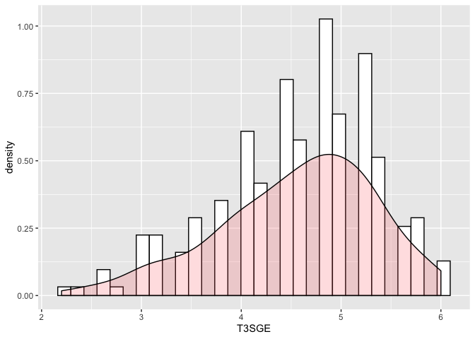

JOUR 3 Modèle linéaire et Boostrap
================
[Retour à la page d'accueil](README.md)


# Un exemple de modélisation :

Le modèle suivant concerne toutes les mesures au temps 3 de l’analyse On
veut prédire le SGE :

  - en fonction du bien-être à l’école RE, Sec, RP, AE, Cl,Act
    (variables autoévaluées)

  - en fonction du niveau de Français et de Math (T3RSF, T3RSM)

  - en contrôlant le Sexe, la strate, la classe et la CSP de la mère.

## Nature des variables :

Identifier la nature de chaque variable et transformer le cas échéant
certaines variables.

## Statistique descriptive :

Représentation graphique de la VD :

``` r
library(ggplot2)

ggplot(BD3, aes(x=T3SGE)) + 
 geom_histogram(aes(y=..density..), colour="black", fill="white")+
 geom_density(alpha=.2, fill="#FF6666") 
```

    ## `stat_bin()` using `bins = 30`. Pick better value with `binwidth`.

<!-- -->

``` r
ggplot(BD3, aes(x=T3SGE)) + 
 geom_histogram(aes(y=..density..), colour="black", fill="white",breaks=2:6)+
 geom_density(alpha=.2, fill="#FF6666") 
```

<!-- -->

Les corrélations :

``` r
library(GGally)
```

    ## Registered S3 method overwritten by 'GGally':
    ##   method from   
    ##   +.gg   ggplot2

``` r
bd_cor<-subset(BD3,select=c(T3SGE,T3RE:T3Act,T3RSF:T3RSM))
ggpairs(bd_cor)
```

<!-- -->

``` r
library(psych)
```

    ## 
    ## Attaching package: 'psych'

    ## The following objects are masked from 'package:ggplot2':
    ## 
    ##     %+%, alpha

``` r
cor.plot(bd_cor,numbers = TRUE)
```

<!-- -->

``` r
library(apaTables)
apa.cor.table(bd_cor,filename="res_cor.doc")
```

## Le nuage de points :

``` r
ggplot(BD3)+
  aes(x=T3RE,y=T3SGE)+
  geom_point()+
  geom_smooth(method="lm")
```

<!-- -->

Le nuage de points avec le sexe :

``` r
ggplot(BD3)+
  aes(x=T3RE,y=T3SGE,color=Sexe)+
  geom_point()+
  geom_smooth(method="lm")
```

<!-- -->

``` r
mod<-lm(T3SGE~T3RE+Sexe,data=BD3)
#str(mod)
mod$coefficients
```

    ## (Intercept)        T3RE       SexeM 
    ##  3.39995045  0.07479831 -0.15048235

``` r
summary(mod)
```

    ## 
    ## Call:
    ## lm(formula = T3SGE ~ T3RE + Sexe, data = BD3)
    ## 
    ## Residuals:
    ##      Min       1Q   Median       3Q      Max 
    ## -2.29592 -0.47130  0.09072  0.52848  1.42767 
    ## 
    ## Coefficients:
    ##             Estimate Std. Error t value Pr(>|t|)    
    ## (Intercept)  3.39995    0.37373   9.097  < 2e-16 ***
    ## T3RE         0.07480    0.02321   3.222  0.00145 ** 
    ## SexeM       -0.15048    0.10366  -1.452  0.14793    
    ## ---
    ## Signif. codes:  0 '***' 0.001 '**' 0.01 '*' 0.05 '.' 0.1 ' ' 1
    ## 
    ## Residual standard error: 0.7654 on 235 degrees of freedom
    ## Multiple R-squared:  0.0437, Adjusted R-squared:  0.03556 
    ## F-statistic: 5.369 on 2 and 235 DF,  p-value: 0.005247

``` r
BD3$predT3SGE<-predict(mod)

ggplot(BD3)+
  aes(x=T3RE,y=T3SGE,color=Sexe)+
  geom_point()+
  geom_line(aes(y=predT3SGE),size=1)
```

<!-- -->

# Le modèle :

## Modèle 1 les variables contrôles

``` r
mod1<- lm(T3SGE~Sexe+T3St+CSPM+T3Classe,data=BD3)
summary(mod1)
```

    ## 
    ## Call:
    ## lm(formula = T3SGE ~ Sexe + T3St + CSPM + T3Classe, data = BD3)
    ## 
    ## Residuals:
    ##      Min       1Q   Median       3Q      Max 
    ## -2.08048 -0.50268  0.07714  0.55524  1.60530 
    ## 
    ## Coefficients:
    ##             Estimate Std. Error t value Pr(>|t|)    
    ## (Intercept)  4.74386    0.23378  20.292   <2e-16 ***
    ## SexeM       -0.09594    0.10419  -0.921   0.3581    
    ## T3StPrivé    0.16269    0.20554   0.792   0.4295    
    ## T3StZEP     -0.16653    0.14041  -1.186   0.2369    
    ## CSPM3        0.05863    0.23183   0.253   0.8006    
    ## CSPM4       -0.13400    0.22661  -0.591   0.5549    
    ## CSPM5        0.16225    0.22065   0.735   0.4629    
    ## CSPM6       -0.43859    0.34494  -1.271   0.2049    
    ## CSPM9        0.01438    0.26666   0.054   0.9570    
    ## T3Classe4   -0.12301    0.15115  -0.814   0.4166    
    ## T3Classe5   -0.23343    0.13954  -1.673   0.0957 .  
    ## T3Classe6   -0.11921    0.17803  -0.670   0.5038    
    ## T3Classe7   -0.12888    0.56432  -0.228   0.8196    
    ## ---
    ## Signif. codes:  0 '***' 0.001 '**' 0.01 '*' 0.05 '.' 0.1 ' ' 1
    ## 
    ## Residual standard error: 0.769 on 225 degrees of freedom
    ## Multiple R-squared:  0.07583,    Adjusted R-squared:  0.02654 
    ## F-statistic: 1.538 on 12 and 225 DF,  p-value: 0.1117

## Modèle 2 : Les variables autoévaluées

``` r
mod2<- lm(T3SGE~Sexe+T3St+CSPM+T3Classe+T3RE+T3Sec+T3RP+T3AE+T3Cl+T3Act,data=BD3)
summary(mod2)
```

    ## 
    ## Call:
    ## lm(formula = T3SGE ~ Sexe + T3St + CSPM + T3Classe + T3RE + T3Sec + 
    ##     T3RP + T3AE + T3Cl + T3Act, data = BD3)
    ## 
    ## Residuals:
    ##      Min       1Q   Median       3Q      Max 
    ## -1.96406 -0.36446  0.05254  0.39783  1.42082 
    ## 
    ## Coefficients:
    ##              Estimate Std. Error t value Pr(>|t|)    
    ## (Intercept)  1.920332   0.406842   4.720 4.20e-06 ***
    ## SexeM       -0.188432   0.089178  -2.113   0.0357 *  
    ## T3StPrivé    0.301107   0.170081   1.770   0.0781 .  
    ## T3StZEP      0.068717   0.116743   0.589   0.5567    
    ## CSPM3        0.198453   0.189367   1.048   0.2958    
    ## CSPM4       -0.008173   0.184277  -0.044   0.9647    
    ## CSPM5        0.211900   0.179591   1.180   0.2393    
    ## CSPM6       -0.246405   0.282313  -0.873   0.3837    
    ## CSPM9        0.120816   0.218147   0.554   0.5803    
    ## T3Classe4   -0.040300   0.123539  -0.326   0.7446    
    ## T3Classe5   -0.179010   0.115550  -1.549   0.1228    
    ## T3Classe6   -0.027160   0.146984  -0.185   0.8536    
    ## T3Classe7   -0.278216   0.465642  -0.597   0.5508    
    ## T3RE         0.020125   0.024052   0.837   0.4037    
    ## T3Sec        0.005993   0.019343   0.310   0.7570    
    ## T3RP         0.130421   0.019754   6.602 3.01e-10 ***
    ## T3AE         0.017231   0.020094   0.857   0.3921    
    ## T3Cl        -0.037504   0.020405  -1.838   0.0674 .  
    ## T3Act        0.075210   0.018645   4.034 7.58e-05 ***
    ## ---
    ## Signif. codes:  0 '***' 0.001 '**' 0.01 '*' 0.05 '.' 0.1 ' ' 1
    ## 
    ## Residual standard error: 0.6237 on 219 degrees of freedom
    ## Multiple R-squared:  0.4082, Adjusted R-squared:  0.3596 
    ## F-statistic: 8.393 on 18 and 219 DF,  p-value: < 2.2e-16

``` r
anova(mod1,mod2)
```

    ## Analysis of Variance Table
    ## 
    ## Model 1: T3SGE ~ Sexe + T3St + CSPM + T3Classe
    ## Model 2: T3SGE ~ Sexe + T3St + CSPM + T3Classe + T3RE + T3Sec + T3RP + 
    ##     T3AE + T3Cl + T3Act
    ##   Res.Df     RSS Df Sum of Sq      F    Pr(>F)    
    ## 1    225 133.063                                  
    ## 2    219  85.202  6    47.861 20.503 < 2.2e-16 ***
    ## ---
    ## Signif. codes:  0 '***' 0.001 '**' 0.01 '*' 0.05 '.' 0.1 ' ' 1

## Modèle 3 : Les variables objectives

``` r
mod3<- lm(T3SGE~Sexe+T3St+CSPM+T3Classe+T3RE+T3Sec+T3RP+T3AE+T3Cl+T3Act+T3RSF+T3RSM,data=BD3)
summary(mod3)
```

    ## 
    ## Call:
    ## lm(formula = T3SGE ~ Sexe + T3St + CSPM + T3Classe + T3RE + T3Sec + 
    ##     T3RP + T3AE + T3Cl + T3Act + T3RSF + T3RSM, data = BD3)
    ## 
    ## Residuals:
    ##      Min       1Q   Median       3Q      Max 
    ## -1.92966 -0.36578  0.05123  0.40949  1.41686 
    ## 
    ## Coefficients:
    ##               Estimate Std. Error t value Pr(>|t|)    
    ## (Intercept)  2.0936543  0.4238851   4.939 1.56e-06 ***
    ## SexeM       -0.1998963  0.0919281  -2.174 0.030750 *  
    ## T3StPrivé    0.2882951  0.1710303   1.686 0.093303 .  
    ## T3StZEP      0.0705497  0.1176242   0.600 0.549272    
    ## CSPM3        0.2122394  0.1895336   1.120 0.264038    
    ## CSPM4       -0.0008136  0.1842549  -0.004 0.996481    
    ## CSPM5        0.1903054  0.1800821   1.057 0.291792    
    ## CSPM6       -0.3133886  0.2858520  -1.096 0.274149    
    ## CSPM9        0.1181774  0.2182950   0.541 0.588811    
    ## T3Classe4   -0.0517331  0.1237296  -0.418 0.676277    
    ## T3Classe5   -0.1762540  0.1155163  -1.526 0.128517    
    ## T3Classe6   -0.0300257  0.1506662  -0.199 0.842225    
    ## T3Classe7   -0.2843483  0.4654669  -0.611 0.541913    
    ## T3RE         0.0189005  0.0243092   0.778 0.437708    
    ## T3Sec        0.0087125  0.0194196   0.449 0.654136    
    ## T3RP         0.1359648  0.0200902   6.768 1.20e-10 ***
    ## T3AE         0.0196724  0.0203059   0.969 0.333723    
    ## T3Cl        -0.0328272  0.0206392  -1.591 0.113172    
    ## T3Act        0.0695232  0.0190351   3.652 0.000326 ***
    ## T3RSF       -0.0364646  0.0517607  -0.704 0.481887    
    ## T3RSM       -0.0259605  0.0514562  -0.505 0.614411    
    ## ---
    ## Signif. codes:  0 '***' 0.001 '**' 0.01 '*' 0.05 '.' 0.1 ' ' 1
    ## 
    ## Residual standard error: 0.6234 on 217 degrees of freedom
    ## Multiple R-squared:  0.4142, Adjusted R-squared:  0.3603 
    ## F-statistic: 7.673 on 20 and 217 DF,  p-value: < 2.2e-16

``` r
anova(mod2,mod3)
```

    ## Analysis of Variance Table
    ## 
    ## Model 1: T3SGE ~ Sexe + T3St + CSPM + T3Classe + T3RE + T3Sec + T3RP + 
    ##     T3AE + T3Cl + T3Act
    ## Model 2: T3SGE ~ Sexe + T3St + CSPM + T3Classe + T3RE + T3Sec + T3RP + 
    ##     T3AE + T3Cl + T3Act + T3RSF + T3RSM
    ##   Res.Df    RSS Df Sum of Sq      F Pr(>F)
    ## 1    219 85.202                           
    ## 2    217 84.336  2   0.86563 1.1136 0.3302

## Version APA tables

``` r
apa.reg.table(mod1,mod2,mod3,filename="res.doc")
```

# Bootstrap

Quelques liens bibliographiques
:

<https://www.math.univ-toulouse.fr/~besse/Wikistat/pdf/st-m-app-bootstrap.pdf>

<http://www.normalesup.org/~carpenti/Notes/Bootstrap/bootstrap.html>

Le cas le plus simple est la moyenne :

``` r
res<-t.test(BD3$T3SGE)
res$conf.int
```

    ## [1] 4.458452 4.657514
    ## attr(,"conf.level")
    ## [1] 0.95

``` r
library(boot)
```

    ## 
    ## Attaching package: 'boot'

    ## The following object is masked from 'package:psych':
    ## 
    ##     logit

``` r
meanfun <- function (x, i){
    d<-x [i]
    return (mean (d))   }

res_boot<-boot(BD3$T3SGE,statistic = meanfun,R=5000)

data<-data.frame(boot=res_boot$t)

ggplot(data, aes(x=boot)) + 
 geom_histogram(aes(y=..density..), colour="black", fill="white")+
 geom_density(alpha=.2, fill="#FF6666") 
```

    ## `stat_bin()` using `bins = 30`. Pick better value with `binwidth`.

<!-- -->

``` r
print(res_boot)
```

    ## 
    ## ORDINARY NONPARAMETRIC BOOTSTRAP
    ## 
    ## 
    ## Call:
    ## boot(data = BD3$T3SGE, statistic = meanfun, R = 5000)
    ## 
    ## 
    ## Bootstrap Statistics :
    ##     original      bias    std. error
    ## t1* 4.557983 0.001092605  0.05050946

``` r
boot.ci(res_boot)
```

    ## Warning in boot.ci(res_boot): bootstrap variances needed for studentized
    ## intervals

    ## BOOTSTRAP CONFIDENCE INTERVAL CALCULATIONS
    ## Based on 5000 bootstrap replicates
    ## 
    ## CALL : 
    ## boot.ci(boot.out = res_boot)
    ## 
    ## Intervals : 
    ## Level      Normal              Basic         
    ## 95%   ( 4.458,  4.656 )   ( 4.461,  4.655 )  
    ## 
    ## Level     Percentile            BCa          
    ## 95%   ( 4.461,  4.655 )   ( 4.455,  4.651 )  
    ## Calculations and Intervals on Original Scale

# Tansformation de données (déplier un tableau) :

``` r
library(reshape2)
BD3long1<-melt(BD3,id.vars="Identifiant",
              value.name="SGE",
              measure.vars = c("T1SGE","T2SGE","T3SGE"))

head(BD3long1)
```

    ##   Identifiant variable SGE
    ## 1     1CE2LC2    T1SGE 5.6
    ## 2     1CE2LC4    T1SGE 6.0
    ## 3     1CE2LC8    T1SGE 5.8
    ## 4     1CE2LC9    T1SGE 5.4
    ## 5    1CE2LC10    T1SGE 6.0
    ## 6    1CE2LC11    T1SGE 6.0
